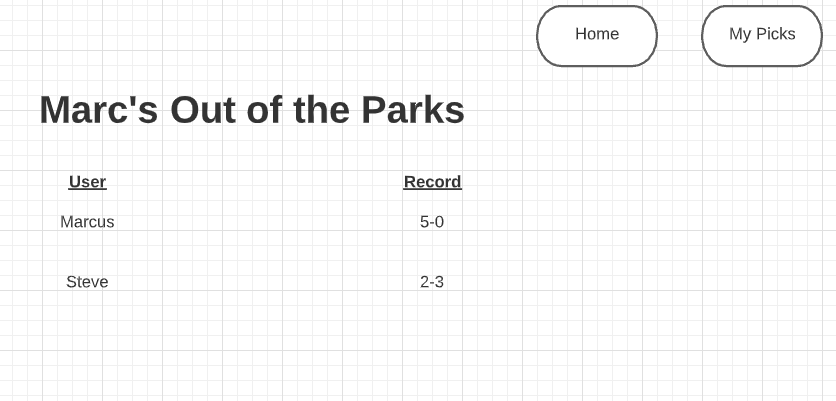

<h1>
Application Title:
Marc's Out of the Parks!
</h1>

Users are able to login with Google and pick their best sports bets. Users are able to add notes, sharks, and confidence levels to their picks. 

Wireframe:

Screenshots:

Technologies Used: HTML, CSS, JavaScript, jQuery, Express, Express Middleware, Node, Mongoose, Heroku, MongoDB, Oauth

Application Link:
https://marcs-parks.herokuapp.com/

Trello Board:
https://trello.com/b/7oqyIqoU/marcs-parks

Next Steps: 
I'd like to track wins and loses and have a leaderboard. Also, do more with Oauth and the user information provided. 